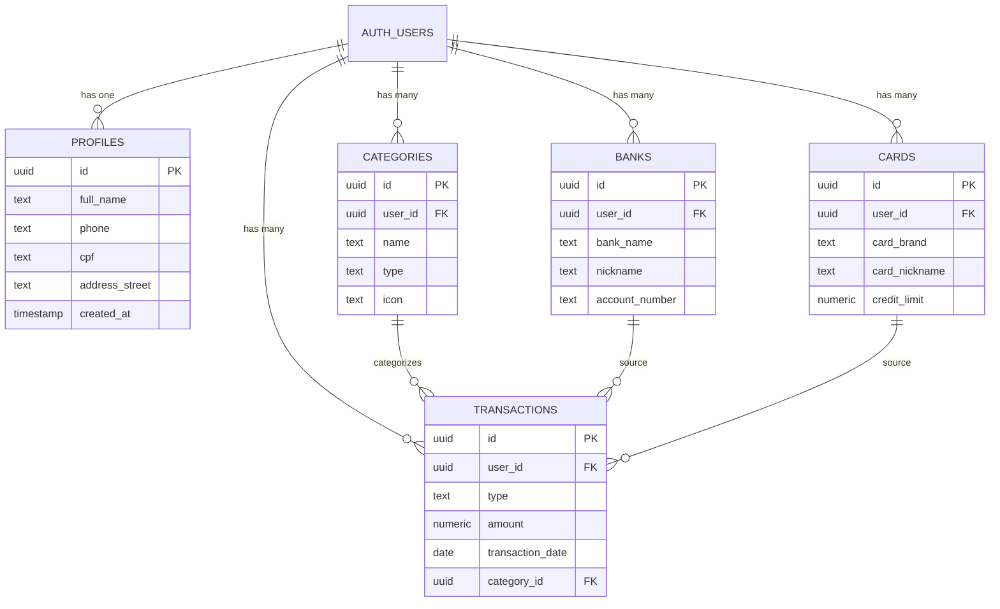

# Database Blueprint - Financial Manager App

## Overview
Este documento descreve a arquitetura completa do banco de dados do aplicativo de gestão financeira, incluindo todas as tabelas, colunas, relacionamentos, políticas RLS (Row Level Security) e índices.

## Technology Stack
- **Database**: PostgreSQL (via Lovable Cloud/Supabase)
- **Authentication**: Supabase Auth
- **Real-time**: Supabase Realtime (quando habilitado)
- **Security**: Row Level Security (RLS) habilitado em todas as tabelas

---

## Tables

### 1. profiles
Armazena informações adicionais do perfil do usuário além dos dados de autenticação.

#### Columns
| Column | Type | Nullable | Default | Description |
|--------|------|----------|---------|-------------|
| id | uuid | No | - | Primary key, referencia auth.users |
| full_name | text | Yes | - | Nome completo do usuário |
| phone | text | Yes | - | Telefone de contato |
| cpf | text | Yes | - | CPF do usuário |
| profile_photo | text | Yes | - | URL da foto de perfil |
| address_street | text | Yes | - | Rua do endereço |
| address_number | text | Yes | - | Número do endereço |
| address_complement | text | Yes | - | Complemento do endereço |
| address_neighborhood | text | Yes | - | Bairro |
| address_city | text | Yes | - | Cidade |
| address_state | text | Yes | - | Estado |
| address_zip | text | Yes | - | CEP |
| created_at | timestamp with time zone | Yes | now() | Data de criação |
| updated_at | timestamp with time zone | Yes | now() | Data de atualização |

#### RLS Policies
- **Users can view own profile** (SELECT): `auth.uid() = id`
- **Users can insert own profile** (INSERT): `auth.uid() = id`
- **Users can update own profile** (UPDATE): `auth.uid() = id`
- **No DELETE allowed**

#### Notes
- O `id` deve corresponder ao `id` do usuário em `auth.users`
- Não permite exclusão de perfis por segurança
- Atualização automática de `updated_at` via trigger recomendado

---

### 2. banks
Armazena informações das contas bancárias dos usuários.

#### Columns
| Column | Type | Nullable | Default | Description |
|--------|------|----------|---------|-------------|
| id | uuid | No | uuid_generate_v4() | Primary key |
| user_id | uuid | No | - | Foreign key para auth.users |
| bank_name | text | No | - | Nome do banco |
| nickname | text | Yes | - | Apelido da conta (ex: "Conta Salário") |
| bank_code | text | Yes | - | Código do banco (ex: "001" para Banco do Brasil) |
| account_type | text | Yes | - | Tipo de conta (corrente, poupança, etc) |
| account_number | text | Yes | - | Número da conta |
| branch_number | text | Yes | - | Número da agência |
| logo_url | text | Yes | - | URL do logo do banco |
| created_at | timestamp with time zone | Yes | now() | Data de criação |

#### RLS Policies
- **Users can view own banks** (SELECT): `auth.uid() = user_id`
- **Users can insert own banks** (INSERT): `auth.uid() = user_id`
- **Users can update own banks** (UPDATE): `auth.uid() = user_id`
- **Users can delete own banks** (DELETE): `auth.uid() = user_id`

#### Indexes (Recomendados)
```sql
CREATE INDEX idx_banks_user_id ON banks(user_id);
```

---

### 3. cards
Armazena informações dos cartões de crédito dos usuários.

#### Columns
| Column | Type | Nullable | Default | Description |
|--------|------|----------|---------|-------------|
| id | uuid | No | uuid_generate_v4() | Primary key |
| user_id | uuid | No | - | Foreign key para auth.users |
| card_brand | text | No | - | Bandeira (VISA, MASTERCARD) |
| card_nickname | text | No | - | Nome/apelido do cartão |
| cardholder_name | text | Yes | - | Nome impresso no cartão |
| card_number_last4 | text | Yes | - | Últimos 4 dígitos do cartão |
| expiration_month | integer | Yes | - | Mês de vencimento (1-12) |
| expiration_year | integer | Yes | - | Ano de vencimento |
| credit_limit | numeric | Yes | - | Limite de crédito |
| billing_due_day | integer | Yes | - | Dia de vencimento da fatura (1-31) |
| card_color | text | Yes | - | Cor principal do cartão (hex) |
| card_gradient_start | text | Yes | - | Cor inicial do degradê (hex) |
| card_gradient_end | text | Yes | - | Cor final do degradê (hex) |
| created_at | timestamp with time zone | Yes | now() | Data de criação |

#### RLS Policies
- **Users can view own cards** (SELECT): `auth.uid() = user_id`
- **Users can insert own cards** (INSERT): `auth.uid() = user_id`
- **Users can update own cards** (UPDATE): `auth.uid() = user_id`
- **Users can delete own cards** (DELETE): `auth.uid() = user_id`

#### Indexes (Recomendados)
```sql
CREATE INDEX idx_cards_user_id ON cards(user_id);
```

#### Business Rules
- `expiration_month` deve estar entre 1 e 12
- `expiration_year` deve ser >= ano atual
- `billing_due_day` deve estar entre 1 e 31
- `credit_limit` deve ser > 0

---

### 4. categories
Armazena categorias de transações (receitas e despesas).

#### Columns
| Column | Type | Nullable | Default | Description |
|--------|------|----------|---------|-------------|
| id | uuid | No | uuid_generate_v4() | Primary key |
| user_id | uuid | No | - | Foreign key para auth.users |
| name | text | No | - | Nome da categoria |
| type | text | No | - | Tipo: 'expense' ou 'income' |
| icon | text | Yes | - | Emoji ou ícone da categoria |
| color | text | Yes | - | Cor da categoria (hex) |
| is_default | boolean | Yes | false | Se é categoria padrão do sistema |
| created_at | timestamp with time zone | Yes | now() | Data de criação |

#### RLS Policies
- **Users can view own categories** (SELECT): `auth.uid() = user_id`
- **Users can insert own categories** (INSERT): `auth.uid() = user_id`
- **Users can update own categories** (UPDATE): `auth.uid() = user_id`
- **Users can delete own categories** (DELETE): `auth.uid() = user_id`

#### Indexes (Recomendados)
```sql
CREATE INDEX idx_categories_user_id ON categories(user_id);
CREATE INDEX idx_categories_type ON categories(type);
```

#### Default Categories
Categorias padrão criadas automaticamente para novos usuários:
- 🍔 Alimentação (expense)
- 🚗 Transporte (expense)
- 🏠 Moradia (expense)
- 💊 Saúde (expense)
- 📚 Educação (expense)
- 🎮 Lazer (expense)
- 🛍️ Compras (expense)
- 📦 Outros (expense)

---

### 5. transactions
Armazena todas as transações financeiras dos usuários.

#### Columns
| Column | Type | Nullable | Default | Description |
|--------|------|----------|---------|-------------|
| id | uuid | No | uuid_generate_v4() | Primary key |
| user_id | uuid | No | - | Foreign key para auth.users |
| type | text | No | - | Tipo: 'income', 'expense', 'transfer' |
| amount | numeric | No | - | Valor da transação |
| description | text | Yes | - | Descrição da transação |
| transaction_date | date | No | - | Data da transação |
| category_id | uuid | Yes | - | Foreign key para categories |
| payment_method | text | Yes | - | Método: 'credit', 'debit', 'cash', etc |
| installments | integer | Yes | 1 | Número total de parcelas |
| installment_number | integer | Yes | 1 | Número da parcela atual |
| source_type | text | Yes | - | Tipo da origem: 'bank', 'card', 'cash' |
| source_id | uuid | Yes | - | ID da origem (bank ou card) |
| destination_type | text | Yes | - | Tipo do destino (para transferências) |
| destination_id | uuid | Yes | - | ID do destino (para transferências) |
| transfer_type | text | Yes | - | Tipo: 'pix', 'ted', 'atm', 'counter' |
| notes | text | Yes | - | Notas adicionais |
| created_at | timestamp with time zone | Yes | now() | Data de criação |

#### RLS Policies
- **Users can view own transactions** (SELECT): `auth.uid() = user_id`
- **Users can insert own transactions** (INSERT): `auth.uid() = user_id`
- **Users can update own transactions** (UPDATE): `auth.uid() = user_id`
- **Users can delete own transactions** (DELETE): `auth.uid() = user_id`

#### Indexes (Recomendados)
```sql
CREATE INDEX idx_transactions_user_id ON transactions(user_id);
CREATE INDEX idx_transactions_date ON transactions(transaction_date DESC);
CREATE INDEX idx_transactions_category ON transactions(category_id);
CREATE INDEX idx_transactions_type ON transactions(type);
CREATE INDEX idx_transactions_source ON transactions(source_type, source_id);
CREATE INDEX idx_transactions_user_date ON transactions(user_id, transaction_date DESC);
```

#### Business Rules
- `amount` deve ser > 0
- Para transações parceladas: `installment_number` <= `installments`
- `type = 'transfer'` requer `destination_type` e `destination_id`
- `payment_method = 'credit'` requer `source_type = 'card'` e `source_id`

---

## Relationships



---

## Common Queries

### 1. Total de Receitas e Despesas por Mês
```sql
SELECT 
  DATE_TRUNC('month', transaction_date) as month,
  type,
  SUM(amount) as total
FROM transactions
WHERE user_id = auth.uid()
  AND transaction_date >= DATE_TRUNC('month', CURRENT_DATE - INTERVAL '6 months')
GROUP BY DATE_TRUNC('month', transaction_date), type
ORDER BY month DESC;
```

### 2. Despesas por Categoria no Mês Atual
```sql
SELECT 
  c.name,
  c.icon,
  c.color,
  SUM(t.amount) as total,
  COUNT(t.id) as transaction_count
FROM transactions t
JOIN categories c ON t.category_id = c.id
WHERE t.user_id = auth.uid()
  AND t.type = 'expense'
  AND t.transaction_date >= DATE_TRUNC('month', CURRENT_DATE)
  AND t.transaction_date < DATE_TRUNC('month', CURRENT_DATE + INTERVAL '1 month')
GROUP BY c.id, c.name, c.icon, c.color
ORDER BY total DESC;
```

### 3. Gastos por Cartão
```sql
SELECT 
  cards.card_nickname,
  cards.card_brand,
  cards.credit_limit,
  SUM(transactions.amount) as total_spent,
  cards.credit_limit - SUM(transactions.amount) as available_limit
FROM cards
LEFT JOIN transactions ON 
  transactions.source_id = cards.id 
  AND transactions.source_type = 'card'
  AND DATE_TRUNC('month', transactions.transaction_date) = DATE_TRUNC('month', CURRENT_DATE)
WHERE cards.user_id = auth.uid()
GROUP BY cards.id, cards.card_nickname, cards.card_brand, cards.credit_limit;
```

### 4. Transações Recentes
```sql
SELECT 
  t.*,
  c.name as category_name,
  c.icon as category_icon,
  CASE 
    WHEN t.source_type = 'card' THEN cards.card_nickname
    WHEN t.source_type = 'bank' THEN banks.nickname
  END as source_name
FROM transactions t
LEFT JOIN categories c ON t.category_id = c.id
LEFT JOIN cards ON t.source_type = 'card' AND t.source_id = cards.id
LEFT JOIN banks ON t.source_type = 'bank' AND t.source_id = banks.id
WHERE t.user_id = auth.uid()
ORDER BY t.transaction_date DESC, t.created_at DESC
LIMIT 20;
```

### 5. Saldo Total em Contas Bancárias
```sql
SELECT 
  b.nickname,
  b.bank_name,
  COALESCE(SUM(
    CASE 
      WHEN t.type = 'income' AND t.destination_id = b.id THEN t.amount
      WHEN t.type = 'expense' AND t.source_id = b.id THEN -t.amount
      WHEN t.type = 'transfer' AND t.destination_id = b.id THEN t.amount
      WHEN t.type = 'transfer' AND t.source_id = b.id THEN -t.amount
      ELSE 0
    END
  ), 0) as balance
FROM banks b
LEFT JOIN transactions t ON 
  (t.source_id = b.id OR t.destination_id = b.id)
  AND t.user_id = auth.uid()
WHERE b.user_id = auth.uid()
GROUP BY b.id, b.nickname, b.bank_name;
```

---

## Triggers and Functions

### Auto-update updated_at
```sql
CREATE OR REPLACE FUNCTION update_updated_at_column()
RETURNS TRIGGER AS $$
BEGIN
  NEW.updated_at = now();
  RETURN NEW;
END;
$$ language 'plpgsql';

CREATE TRIGGER update_profiles_updated_at 
  BEFORE UPDATE ON profiles
  FOR EACH ROW
  EXECUTE FUNCTION update_updated_at_column();
```

### Create Default Categories on User Signup
```sql
CREATE OR REPLACE FUNCTION create_default_categories_for_user()
RETURNS TRIGGER AS $$
BEGIN
  INSERT INTO public.categories (user_id, name, icon, color, type, is_default)
  VALUES
    (NEW.id, 'Alimentação', '🍔', '#EF4444', 'expense', true),
    (NEW.id, 'Transporte', '🚗', '#F59E0B', 'expense', true),
    (NEW.id, 'Moradia', '🏠', '#8B5CF6', 'expense', true),
    (NEW.id, 'Saúde', '💊', '#EC4899', 'expense', true),
    (NEW.id, 'Educação', '📚', '#3B82F6', 'expense', true),
    (NEW.id, 'Lazer', '🎮', '#10B981', 'expense', true),
    (NEW.id, 'Compras', '🛍️', '#F97316', 'expense', true),
    (NEW.id, 'Outros', '📦', '#6B7280', 'expense', true);
  RETURN NEW;
END;
$$ language 'plpgsql';

CREATE TRIGGER on_auth_user_created
  AFTER INSERT ON auth.users
  FOR EACH ROW
  EXECUTE FUNCTION create_default_categories_for_user();
```

---

## Security Considerations

1. **Row Level Security (RLS)**: Todas as tabelas têm RLS habilitado para garantir que usuários só acessem seus próprios dados.

2. **No Direct Auth Table Access**: Nunca referencie `auth.users` diretamente via foreign keys. Use `user_id` como UUID e compare com `auth.uid()`.

3. **Soft Deletes**: Considere implementar soft deletes para transações importantes (adicionar coluna `deleted_at`).

4. **Audit Trail**: Para maior segurança, considere adicionar tabela de auditoria para rastrear mudanças em transações.

5. **Data Validation**: Implemente validações no lado do cliente E triggers no banco de dados para garantir integridade dos dados.

---

## Future Enhancements

### Tabelas Adicionais Sugeridas

#### budgets
Orçamentos mensais por categoria
```sql
CREATE TABLE budgets (
  id uuid PRIMARY KEY DEFAULT uuid_generate_v4(),
  user_id uuid NOT NULL,
  category_id uuid REFERENCES categories(id),
  month date NOT NULL,
  amount numeric NOT NULL,
  created_at timestamptz DEFAULT now()
);
```

#### recurring_transactions
Transações recorrentes
```sql
CREATE TABLE recurring_transactions (
  id uuid PRIMARY KEY DEFAULT uuid_generate_v4(),
  user_id uuid NOT NULL,
  description text,
  amount numeric NOT NULL,
  category_id uuid REFERENCES categories(id),
  frequency text NOT NULL, -- 'daily', 'weekly', 'monthly', 'yearly'
  start_date date NOT NULL,
  end_date date,
  last_generated_date date,
  is_active boolean DEFAULT true,
  created_at timestamptz DEFAULT now()
);
```

#### notifications
Sistema de notificações
```sql
CREATE TABLE notifications (
  id uuid PRIMARY KEY DEFAULT uuid_generate_v4(),
  user_id uuid NOT NULL,
  type text NOT NULL, -- 'bill_due', 'budget_alert', 'goal_reached'
  title text NOT NULL,
  message text,
  read boolean DEFAULT false,
  action_url text,
  created_at timestamptz DEFAULT now()
);
```

#### goals
Metas financeiras
```sql
CREATE TABLE goals (
  id uuid PRIMARY KEY DEFAULT uuid_generate_v4(),
  user_id uuid NOT NULL,
  name text NOT NULL,
  target_amount numeric NOT NULL,
  current_amount numeric DEFAULT 0,
  target_date date,
  category_id uuid REFERENCES categories(id),
  created_at timestamptz DEFAULT now()
);
```

---

## Performance Optimization

1. **Indexes**: Criar índices compostos para queries frequentes
2. **Materialized Views**: Para dashboards com cálculos complexos
3. **Partitioning**: Particionar tabela de transações por data quando crescer muito
4. **Caching**: Implementar cache Redis para dados frequentemente acessados

---

## Backup and Maintenance

1. **Backups Automáticos**: Lovable Cloud/Supabase faz backups diários automaticamente
2. **Point-in-Time Recovery**: Disponível para restauração de dados
3. **Data Retention**: Definir política de retenção de dados antigos
4. **Archive Strategy**: Mover transações antigas (>2 anos) para tabela de arquivo

---

## Version History

| Version | Date | Changes |
|---------|------|---------|
| 1.0.0 | 2025-11-07 | Initial database schema |
| 1.0.1 | 2025-11-07 | Added default categories migration |
| 1.0.2 | 2025-11-07 | Fixed leaked password protection |

---

## Contact & Support

Para questões sobre o banco de dados ou sugestões de melhorias, entre em contato com a equipe de desenvolvimento.

**Last Updated**: November 7, 2025
